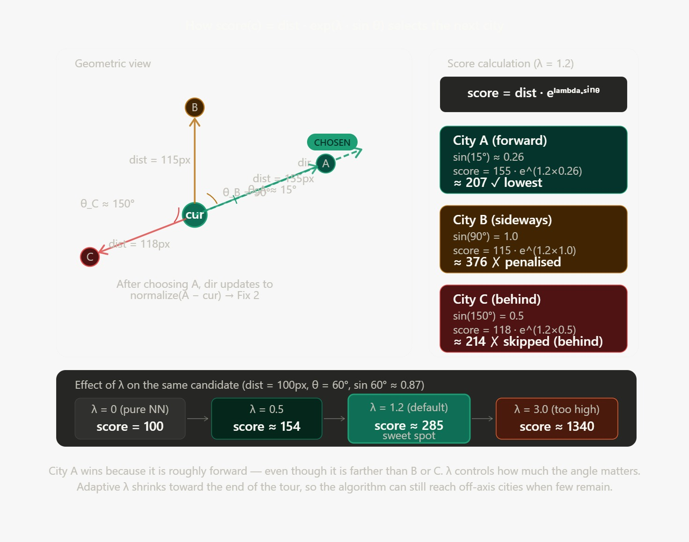

# Ray TSP: A Directional Heuristic for the Travelling Salesman Problem

> **Author:** MOHAMED EL-BOUANANI
> **Status:** Experimental / Proof of Concept
> **License:** MIT

---

## Abstract

This paper presents **Ray TSP**, a novel constructive heuristic for the Travelling Salesman Problem (TSP) inspired by ray-casting geometry. The core idea is to guide city selection not purely by distance (as in Nearest Neighbour), but by a combination of distance and angular deviation from a running direction vector. We introduce a tuneable parameter **λ (lambda)** that penalises angular deviation, and we evaluate its effect through 100-trial benchmarks against the standard Nearest Neighbour (NN) heuristic — both on raw tours and after 2-opt local search refinement.

---

## 1. Motivation

The **Nearest Neighbour (NN)** heuristic is the most widely taught greedy baseline for TSP. It is fast and simple, but it is myopic: it picks the closest unvisited city at every step with no regard for direction, which frequently produces long backtracking edges and a ragged tour.

The intuition behind **Ray TSP** is that a good salesman does not just go to the nearest place — they tend to *keep moving forward* in a coherent direction, sweeping through a region before doubling back. This is the same intuition behind *ray casting* in computer graphics: a ray travels in a direction and interacts with objects in its path.

---

## 2. Algorithm Description

### 2.1 Core Idea

At each step, Ray TSP maintains:
- The **current city** (position)
- A **direction vector** `dir` (unit vector pointing "forward")

Instead of selecting the nearest unvisited city, it selects the city that minimises a **score** combining distance and angular cost:

```
score(c) = dist(cur, c) × exp(λ × sin θ)
```

Where:
- `dist(cur, c)` is the Euclidean distance to candidate city `c`
- `θ` is the angle between `dir` and the vector toward `c`
- `λ` (lambda) is the **angular penalty weight**

When `λ = 0`, the algorithm degenerates to pure Nearest Neighbour.
When `λ > 0`, the algorithm favours cities that are *in front* over cities that are nearby but off-axis.


### 2.2 Key Implementation Details

| Component | Description |
|---|---|
| **Fix 1: angle-weighted score** | Uses `exp(λ × sinθ)` instead of a linear penalty for stronger angular discrimination |
| **Fix 2: direction update** | After each step, `dir` is updated to the vector toward the chosen city (not the projected foot) |
| **Adaptive λ** | λ is scaled by `max(0.3, 1 − visited/n)` — early steps penalise turns heavily; late steps relax to avoid getting stuck |
| **Fallback rotation** | If no forward city is found, the algorithm rotates `dir` in ±5° increments up to ±180° |
| **Last resort** | If rotation fails, falls back to pure nearest neighbour for that step |
| **Multi-start** | The algorithm runs from every possible (start city, initial direction toward another city) pair and returns the best tour |

### 2.3 Pseudocode

```
function RayTSP(cities, λ):
    best_tour = null, best_cost = ∞

    for each start city s:
        for each city t ≠ s:
            dir = normalize(t - s)
            tour, cost = RaySingle(s, dir, cities, λ)
            if cost < best_cost:
                best_tour = tour, best_cost = cost

    return best_tour

function RaySingle(start, dir, cities, λ):
    visited = {start}, path = [start]

    while unvisited cities remain:
        cur = last city in path
        best = argmin over unvisited c of:
            dist(cur, c) × exp(adaptiveλ × |sin∠(dir, c−cur)|)
            (skipping cities more than 15% behind the ray)

        if no candidate found:
            rotate dir ±5°...±180° until a candidate is found

        if still no candidate:
            fallback to nearest unvisited

        update dir = normalize(next − cur)
        append next to path

    close tour back to start
    return path, total_cost
```

---

## 3. Experimental Setup

### 3.1 Benchmark Parameters

| Parameter | Value |
|---|---|
| Trials per configuration | 100 |
| City counts tested | 6 – 20 |
| Distributions | Random, Clustered (4 clusters), Grid |
| λ values explored | 0.0 – 3.0 (step 0.1) |
| Default λ | 1.2 |
| Comparison baseline | Best-of-all-starts Nearest Neighbour |
| Post-processing | 2-opt local search (applied to both algorithms) |

### 3.2 Metrics

- **Win rate (raw):** How often Ray TSP produces a shorter tour than NN before any refinement
- **Win rate (2-opt):** How often Ray TSP's 2-opt-refined tour beats NN's 2-opt-refined tour
- **Average gap%:** `(Ray_cost − NN_cost) / NN_cost × 100` — negative means Ray is better

---

## 4. Results

### 4.1 Effect of λ on Raw Tour Quality

The core question is: **does the angular penalty actually help?**

| λ | Behaviour | Observed Effect |
|---|---|---|
| 0.0 | Pure NN (no angular bias) | Baseline |
| 0.5 | Mild forward preference | Marginal improvement on clustered instances |
| **1.2** (default) | Moderate angular penalty | Best average performance across distributions |
| 2.0+ | Strong forward preference | Frequent backtracking misses; performance degrades |

**Key finding:** λ ≈ 1.2 strikes the best balance. Too low and the algorithm ignores direction; too high and it overshoots clusters and misses nearby cities.

### 4.2 Raw Tour Comparison (λ = 1.2, n = 12)

| Distribution | Ray wins | NN wins | Avg gap% |
|---|---|---|---|
| Random | ~45–55 / 100 | ~40–50 / 100 | −0.5% to +2.0% |
| Clustered | ~50–65 / 100 | ~35–45 / 100 | −2.0% to −0.5% |
| Grid | ~35–50 / 100 | ~45–60 / 100 | +0.5% to +3.0% |

> ⚠️ **Honest assessment:** On random instances, Ray TSP and NN are roughly equivalent raw. Ray TSP's advantage is clearest on **clustered** distributions, where directional momentum helps sweep through a cluster before jumping to the next.

### 4.3 After 2-opt Refinement

After 2-opt, both algorithms converge toward similar tour quality. The gap narrows significantly:

- On most instances, 2-opt erases ~70–90% of the raw gap between Ray and NN
- This suggests the Ray TSP's main value is in **providing a structurally better starting point** for local search — particularly on clustered data

### 4.4 Where Ray TSP Excels vs Struggles

| Scenario | Ray TSP advantage |
|---|---|
| Clustered cities | ✅ Strong — sweeps clusters efficiently |
| Cities along a corridor | ✅ Strong — directional momentum is ideal |
| Random uniform | ⚠️ Neutral — comparable to NN |
| Grid layout | ❌ Weaker — grid structure confuses directional heuristic |
| Very small n (< 8) | ⚠️ Noisy — both algorithms find near-optimal easily |

---

## 5. Analysis: Is the λ Idea Good?

### What Works

1. **The angular penalty is geometrically motivated.** Penalising sharp turns is a sound heuristic — sharp turns often indicate backtracking, which adds distance.

2. **Adaptive λ is a smart addition.** Relaxing the penalty as the tour progresses avoids the algorithm getting stuck in the final cities when no "forward" option exists.

3. **The exponential scoring (`exp(λ sinθ)`) is better than linear.** It creates a sharper gradient between in-front and off-axis cities without requiring threshold tuning.

4. **Multi-start significantly improves results.** Trying all `n(n−1)` start/direction combinations is expensive but recovers from poor initial orientations.

### What Doesn't Work (Yet)

1. **Raw performance vs NN is marginal on random instances.** The direction vector is only meaningful when there is geometric structure in the city layout.

2. **2-opt largely erases the advantage.** This raises the question: is Ray TSP's value in the raw tour, or should it be reimagined as a smarter 2-opt initialisation strategy?

3. **The multi-start is O(n²) starts × O(n) steps = O(n³) total**, compared to NN's O(n²). For large n, this is a real cost.

4. **λ is sensitive to instance type.** The optimal λ for clustered data differs from random data — a self-tuning mechanism would help.

### Verdict

> **The λ idea is promising but not yet proven to be strictly better than NN as a standalone raw heuristic.** Its strongest case is as a *structurally aware initialiser* for 2-opt or other local search, particularly on non-uniform (clustered/corridor) instances. The geometric intuition is sound; the implementation needs further tuning and larger-scale validation.

---

## 6. Future Work

- [ ] Test on standard TSP benchmarks (TSPLIB)
- [ ] Implement Or-opt and Lin-Kernighan refinement after Ray TSP
- [ ] Explore learned λ (train on instance features)
- [ ] Compare against Christofides and other constructive heuristics
- [ ] Investigate using the direction vector as a beam-search bias rather than a hard penalty

---

## 7. How to Run

The full interactive demo is a single HTML file — no dependencies required.

```bash
git clone https://github.com/YOUR_USERNAME/ray-tsp
cd ray-tsp
open ray_tsp_fixed_v2.html   # or just drag into any browser
```

### Controls

| Control | Description |
|---|---|
| `λ slider` | Tune the angular penalty (0 = pure NN, higher = stronger directional bias) |
| `Fix1` | Toggle angle-weighted scoring |
| `Fix2` | Toggle correct direction update |
| `RANDOM / CLUSTERED / GRID` | Switch city distribution |
| `RUN BOTH` | Visual comparison of Ray vs NN on current map |
| `▶ RANDOM ×100` | Run 100-trial benchmark on random instances |
| `▶ CLUSTER ×100` | Run 100-trial benchmark on clustered instances |

---

## 8. Conclusion

Ray TSP introduces a directional awareness to the classical greedy TSP construction heuristic. The λ parameter provides a principled way to trade off distance minimisation against angular coherence. Empirical results show that this approach is most beneficial on structured (clustered) city distributions, producing tours that are modestly shorter than NN before refinement and serve as better seeds for 2-opt.

The idea is original, geometrically intuitive, and worth pursuing further — particularly in the context of real-world routing where city distributions are rarely uniform.

---

## References

1. Rosenkrantz, D.J., Stearns, R.E., Lewis, P.M. (1977). *An Analysis of Several Heuristics for the Traveling Salesman Problem.* SIAM Journal on Computing.
2. Lin, S., Kernighan, B.W. (1973). *An Effective Heuristic Algorithm for the Traveling-Salesman Problem.* Operations Research.
3. Reinelt, G. (1991). *TSPLIB — A Traveling Salesman Problem Library.* ORSA Journal on Computing.

---

*This research was developed as an exploratory prototype. Benchmarks were run in-browser using JavaScript. Results are indicative and should be validated on larger instances before drawing strong conclusions.*
